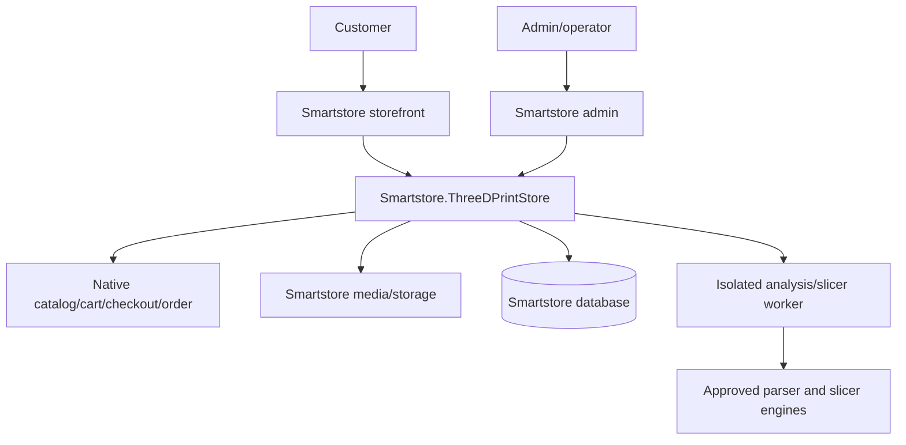

# System context

```mermaid
flowchart TB
    Customer[Customer] --> Storefront[Smartstore storefront]
    Operator[Admin/operator] --> Admin[Smartstore admin]
    Storefront --> Module[Smartstore.ThreeDPrintStore]
    Admin --> Module
    Module --> Catalog[Native catalog/cart/checkout/order]
    Module --> Media[Smartstore media/storage]
    Module --> DB[(Smartstore database)]
    Module --> Worker[Isolated analysis/slicer worker]
    Worker --> Engines[Approved parser and slicer engines]
```
