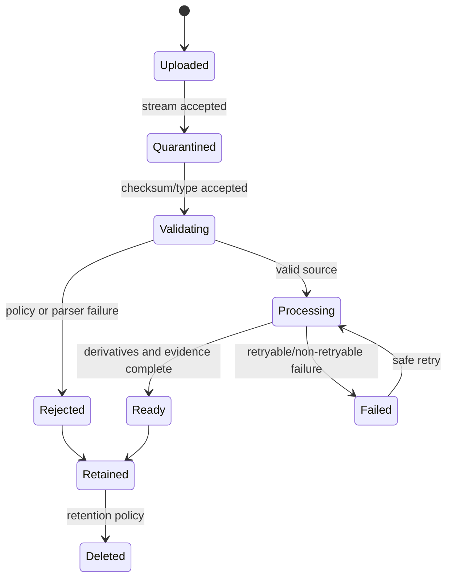

# Upload processing

```mermaid
stateDiagram-v2
    [*] --> Uploaded
    Uploaded --> Quarantined: stream accepted
    Quarantined --> Validating: checksum/type accepted
    Validating --> Rejected: policy or parser failure
    Validating --> Processing: valid source
    Processing --> Ready: derivatives and evidence complete
    Processing --> Failed: retryable/non-retryable failure
    Failed --> Processing: safe retry
    Ready --> Retained
    Rejected --> Retained
    Retained --> Deleted: retention policy
```
